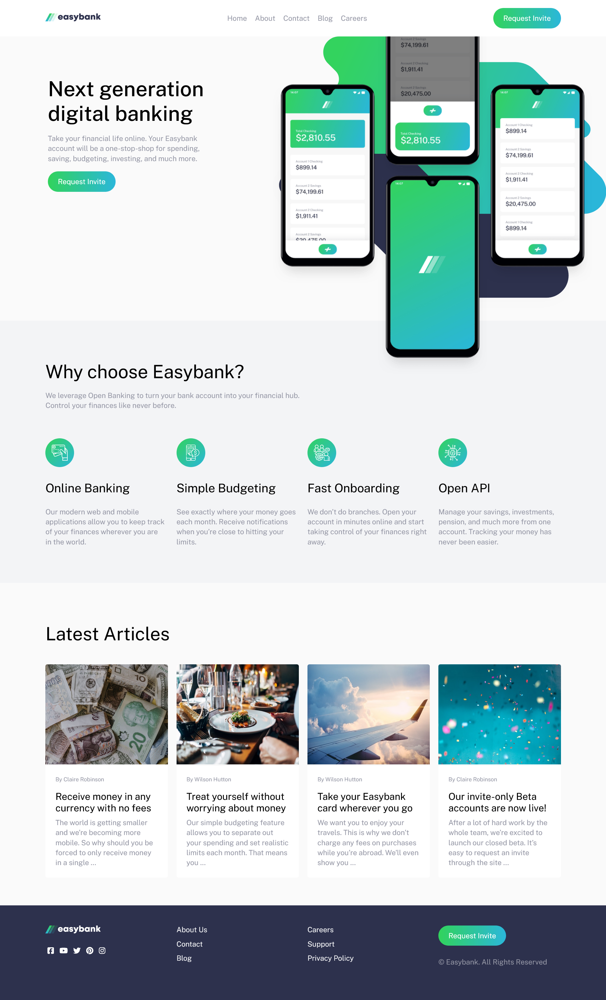

# Easybank Landing Page Challenge

This is the source code for the "Easybank" landing page, a fictional digital banking website showcasing modern banking features. This challenge is from [Frontend Mentor](https://www.frontendmentor.io/home)

## Table of Contents
- [Design](#design)
- [Description](#description)
- [Technologies](#technologies)
- [Features](#features)
- [Links](#links)
- [Author](#author)

## Design

## Description

Easybank is a modern digital banking solution designed to streamline and enhance your financial management experience. This landing page demonstrates the features and benefits of Easybank, including online banking, simple budgeting, fast onboarding, and open API.

## Technologies

- HTML
- CSS
- FontAwesome (for icons)
- JavaScript

## Features

- **Header:** 
  - Navbar with links to Home, About, Contact, Blog, and Careers.
  - "Request Invite" button.
  - Mobile menu button.

- **Home Section:** 
  - Introductory section with background image and promotional text.
  - Call-to-action button for requesting an invite.

- **Why Choose Easybank Section:**
  - Highlights Easybank’s unique selling points such as Online Banking, Simple Budgeting, Fast Onboarding, and Open API.

- **Latest Articles Section:** 
  - Showcases recent articles with images, author names, titles, and brief descriptions.

- **Footer:**
  - Social media icons and links to various sections like About Us, Contact, Blog, Careers, Support, and Privacy Policy.
  - "Request Invite" button.
  - Copyright notice.

## Links

- GitHub Repo - [Repo](https://github.com/basemsameh/Easybank-landing-page.git)
- Challenge on [Frontend Mentor](https://www.frontendmentor.io/challenges/easybank-landing-page-WaUhkoDN)
- Live URL - [Demo]()

## Author

- Linkedin - [Basem Sameh](https://www.linkedin.com/in/basem-sameh-671b5b212/)
- Frontend Mentor - [@basemsameh](https://www.frontendmentor.io/profile/basemsameh)